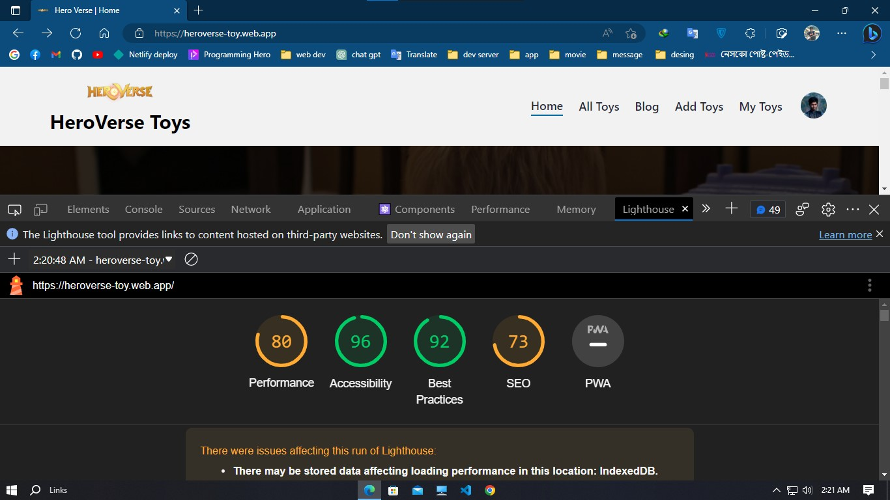

# HeroVers Toys

It is a MERN stark application project. This project about Action Super hero Toy selling and Posting .

## Live link

- [HeroVers Toy](https://heroverse-toy.web.app/)

## Deployment

Develop by [Rofikil islam Resan](https://github.com/rofikul-resan)

To deploy this project run

```bash
  npm run dev
```

## Features

- Post Toy for Selling
- View Your post
- Update Post data
- log in with
  - Email
  - Google gmail
  - Facebook
  - Github
- See totol 20 Post per page
- only valid User add , post , update and delete post .

## Used technology

- React
- firebase
- daisyui
- react-dom
- react-icons
- react-lazy-load
- react-rating
- react-router-dom
- react-spinners
- sweetalert2
- swiper slider
- express

## 🚀 About Me

I'm a React developer from Bangladesh ...

## 🔗 Links

[](https://github.com/rofikul-resan)
[](https://twitter.com/)

## Installation

Install my-project with npm

```bash
  npm install my-project
  cd my-project
```

## Optimizations

What optimizations did you make in your code? E.g. refactors, performance improvements, accessibility

## Lighthouse performance


